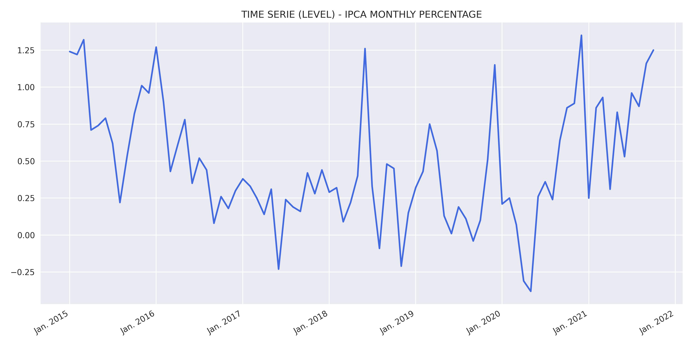
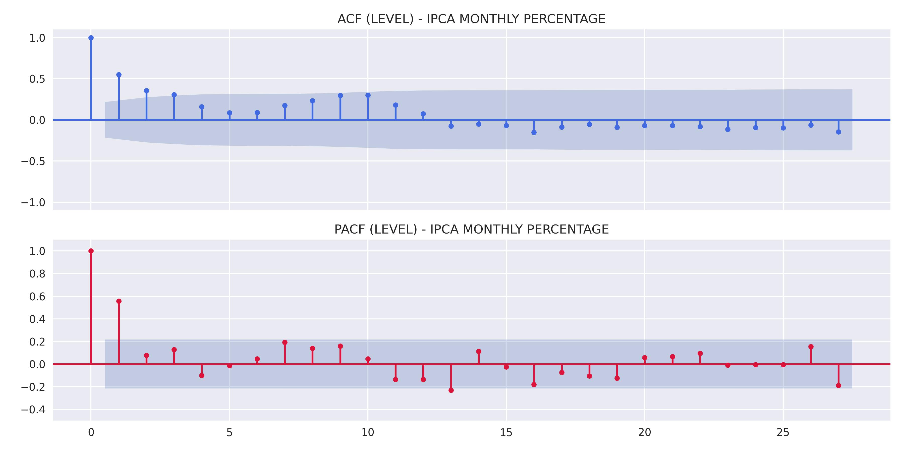
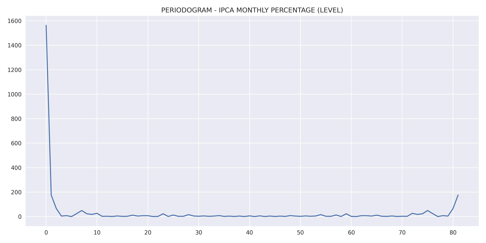
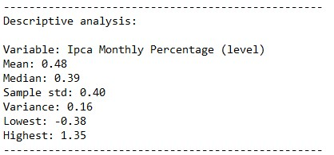
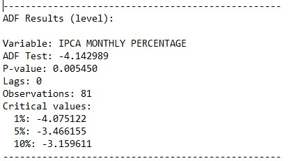
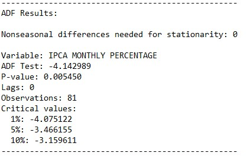
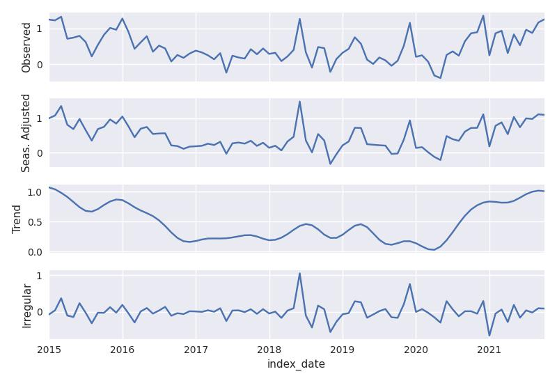
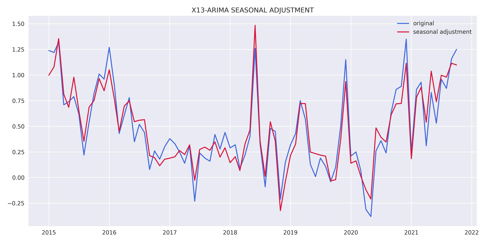
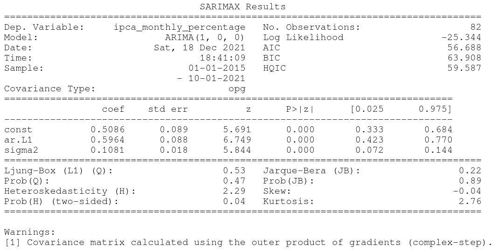

 
  
  
  </a>
  
   
  
  
  
  
  
  
   
  
  </a>
  
  
  

# **DESCRIPTION**
The IPCA is an indicator to track inflation. It is calculated based on the average price needed to buy a set of goods and services in a country, compared to previous periods.

Source: https://www.ibge.gov.br/estatisticas/economicas/precos-e-custos/9256-indice-nacional-de-precos-ao-consumidor-amplo.html

# **RESULTS**
Results obtained through the model estimation process.

## Variable analysis at level:
    

    

    

    

## Study of data stationarity:
    

    

## X13-ARIMA-SEATS RESULTS:
    

    

## Model results:
    

## Residual analysis:
    

    

    

## Forecast:
    
